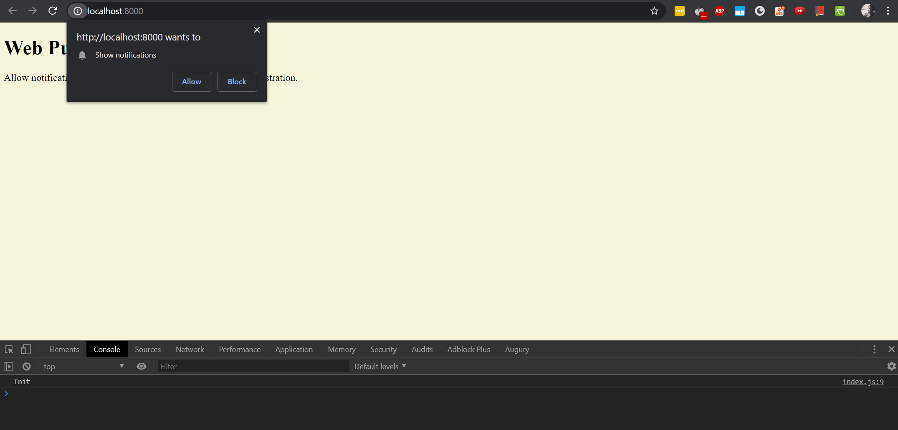
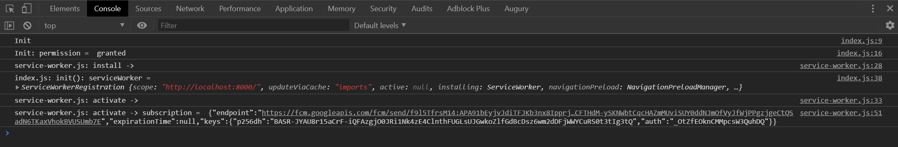
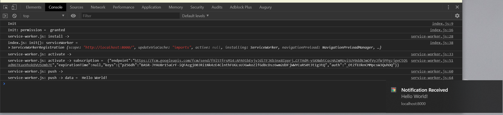

# Web Push Demo

Main libraries and frameworks used:
- Node.js
- web-push

# Getting Started

## Starting the server

```sh
cd backend
npm install
npm run dev
```

Check if the server is live, `localhost:4000/health`

## Starting the web frontend

```sh
cd frontend
npm install
# -c-1 disable caching, to load changed files immediately
npx http-server -c-1 -p 8000
```

## Test push notification

- Open `http://localhost:8000/` and allow permission



- The console log will show the service worker registration log.



- Opening `localhost:4000/send-notification` in another browser will generate and send push notification to to `http://localhost:8000/`



# References

- [web-push package](https://github.com/web-push-libs/web-push)
- Google's [guide on using web-push](https://developers.google.com/web/ilt/pwa/introduction-to-push-notifications)

- The source code is adapted from [this](https://medium.com/izettle-engineering/beginners-guide-to-web-push-notifications-using-service-workers-cb3474a17679)  tutorial
